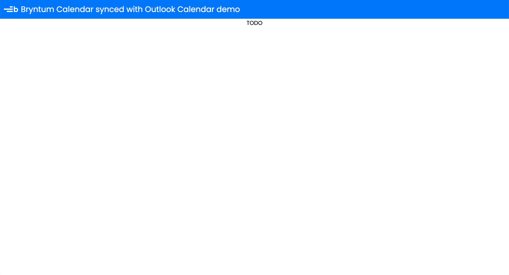

# How to connect and sync a React Bryntum Calendar to a Microsoft Outlook Calendar

This starter project was generated using the [Vite with TypeScript and React starter template](https://vite.dev/guide/#scaffolding-your-first-vite-project).

The code for the complete app is on the `completed-calendar` branch.

## Getting started

Install the dependencies by running the following command: 

```sh
npm install
```

## Running the app

Run the local dev server using the following command:

```sh
npm run dev
```

Open `http://localhost:5173`. You will see a blue header with the title **Bryntum Calendar synced with Outlook Calendar demo** and text reading **TODO** rendered below the header:

